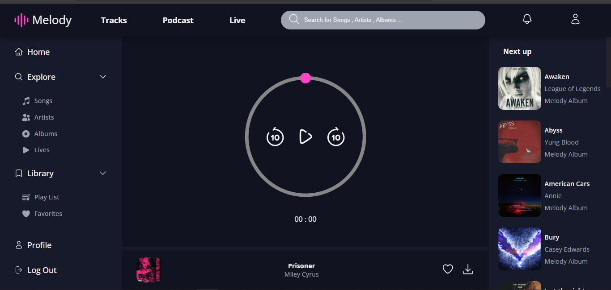

# Music Player

This project is a simple web music player built using JavaScript, HTML, and CSS, with no external libraries or frameworks. The player allows you to play audio files in a simple, user-friendly interface.

## Features:
- Play, pause, and control volume
- Skip to the next or previous track
- Display track name and artist image
- Simple and clean user interface

## Screenshots:
🎵 **Home Page**

🎶 **Now Playing**

## How to Use:
1. Download or clone the project files.
2. Open the `index.html` file in your browser.
3. Use the control buttons to play music and enjoy listening to your tracks.

## Project Structure:
- `index.html`: The main structure of the web pages.
- `style.css`: Styling for the pages and UI design.
- `script.js`: Logic for music playback and various controls.

## Installation:
Just download or clone the project, and open the `index.html` file in your browser. No installation required.
